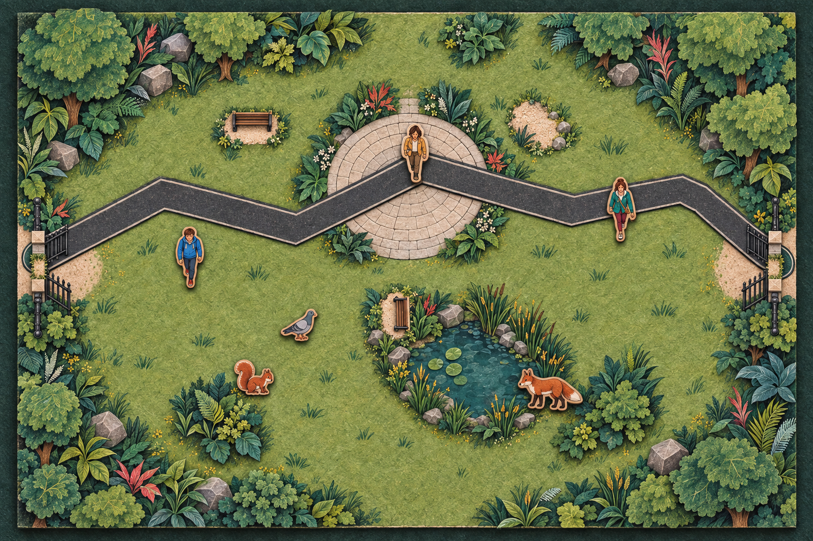
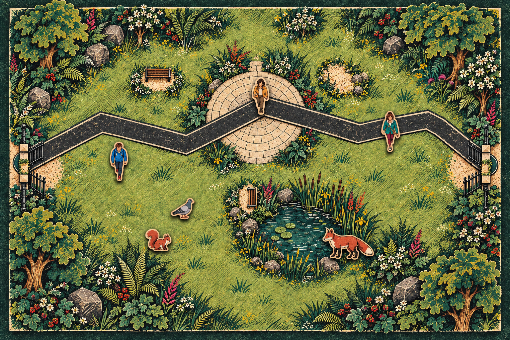
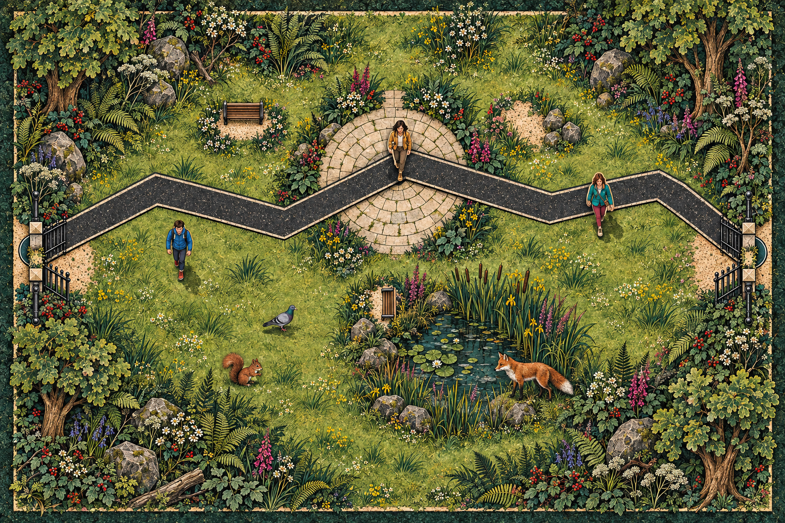
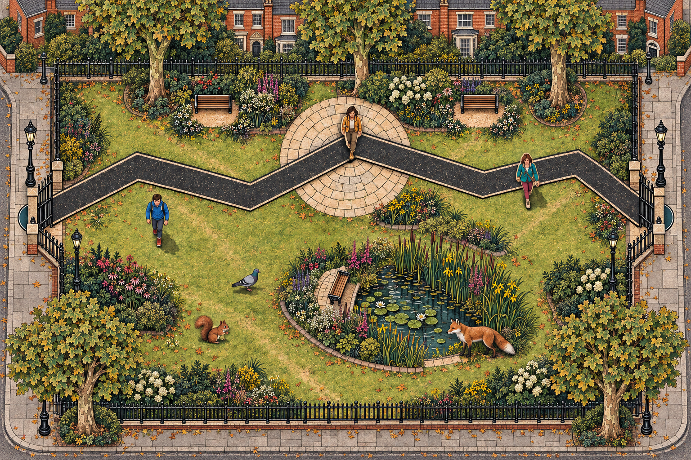

# Park art-direction drafts — 2026-09-10

These generated concept images explore a more coherent visual language for the same P0 park layout. They are comparison drafts only; the Unity scene has not yet been changed to match one direction.

## Shared functional constraints

- Preserve the overhead 3:2 park-board composition and approximate placement of gates, asphalt route, plaza, pond, woodland, benches, people, pigeon, squirrel and fox.
- Remove the yellow plaza oval and cyan pond oval entirely.
- Show zone boundaries through paving, shoreline, planting, texture, material depth or shadow—not neon rings, halos or selection UI.
- Keep people, animals and environment within one coherent palette and rendering system.

## Options

### A — Gouache storybook


Prompt direction: gentle contemporary gouache and watercolor planning-storybook illustration; cohesive hand-painted brush texture; soft natural British park palette; plaza defined by paving and planting; pond defined by reeds, stones and damp ground.

### B — Tactile paper and felt


Prompt direction: premium tabletop prototype made from layered matte cardstock, laser-cut wood veneer and felt; restrained research-prototype aesthetic; plaza and pond boundaries expressed as physical inlays, stitching and material changes.

### C — Ecological planning map


Prompt direction: sophisticated ecological planning map and editorial strategy-game illustration; simplified shapes, subtle paper grain and limited moss/sage/stone/charcoal palette; quieter information hierarchy and less visual noise.

### D — Miniature diorama


Prompt direction: handcrafted museum-quality miniature park diorama viewed directly overhead; matte painted wood, sculpted foliage, flocked grass and restrained natural shadows; plaza inset in stone and pond recessed in translucent resin.

### E — Recommended hybrid



Prompt direction: use the tactile board structure of B as the foundation, add restrained coloured-pencil paper grain and layered botanical illustration, reduce perimeter decoration by roughly one third, and reserve coral and mustard for small functional accents. People, animals and landscape use the same matte wooden-paper token language; plaza and pond boundaries are built into their materials instead of drawn as coloured rings.

### F — Expressive natural-history print



Prompt direction: push E toward an authored natural-history print using coloured-pencil hatching, variable ink outlines, linocut marks, risograph texture and selective vermilion/magenta accents. Exaggerate animal and botanical silhouettes while keeping the asphalt path as a clear near-charcoal field and preserving open playable grass. Use British urban-park vegetation and no coloured zone rings.

### G — Realistic stylized botanical print V0.1



Prompt direction: increase anatomical, botanical and material realism without becoming photographic. Keep the mature natural-history print language through variable ink contours, fine stippling, engraved hatching, imperfect colour separation and weathered paper grain. Concentrate detail around woodland and water while keeping the route and playable grass quieter.

Exact final prompt:

```text
Use case: style-transfer
Asset type: landscape 3:2 concept art for a top-down Unity urban-wildlife park simulation.
Input images: Image 1 is the EDIT TARGET and authoritative layout/composition reference. Images 2, 3, and 4 are STYLE REFERENCES ONLY for botanical realism, print grain, stippling, ink contour rhythm, and expressive colour separation.
Primary request: Re-render Image 1 in a more realistic yet clearly stylized visual direction. Preserve the same complete park layout, camera, gameplay legibility and semantic zones while making nature, materials, people and wildlife feel more believable and mature.
Layout invariants: strict high orthographic bird's-eye view; wide 3:2 board; the same black asphalt zigzag path crossing left to right; open black fence gates at both sides; central circular pale-stone plaza; pond in the lower-right-central area with reeds and lilies; benches, surrounding woodland edge, open grass clearings, three people and exactly one pigeon, one red squirrel and one red fox in approximately the same positions and relative sizes. Keep ample navigable open grass; do not let plants cover the route or gameplay areas.
Style/medium: sophisticated natural-history field illustration blended with vintage botanical lithograph and contemporary game concept art. More anatomical and botanical realism than Image 1, but not photorealistic. Use confident variable ink lines, fine stippling and engraved hatching, layered print grain, subtle imperfect registration, dense detail concentrated at the woodland border and pond edge, and cleaner lower-detail open areas for game readability. Natural proportions and recognizable British park plants, trees and animals. Avoid cute sticker outlines and chibi proportions.
Materials/textures: convincingly rough black asphalt with fine aggregate and thin pale edging; individually laid weathered plaza stones; water with dark depth, small reflections and organic shoreline; realistic bark, leaves, reeds, grass tufts and irregular rocks. Preserve stylized linework across every material.
Colour palette: deep bottle green and near-black shadows, varied moss/olive/sage greens, warm parchment stone, burnt orange and rust, restrained cobalt and plum, selective magenta/coral flower accents. Rich but harmonized, slightly weathered print colours; characters and animals must share the same paper grain, saturation and ink treatment as the environment.
Lighting/mood: soft overcast British daylight, calm, tactile and slightly mysterious; clear value separation around characters and routes.
Constraints: no text, labels, numbers, UI, token circles, glowing rings, selection halos, icons or watermark. No extra people or animals. No fantasy jungle, no tropical oversized leaves, no photographic collage, no 3D render, no flat children's-book cartoon. Preserve the full rectangular board without cropping and keep all functional elements readable.
```

### H — Urban neighbourhood park V0.1



Prompt direction: correct G's nature-reserve feeling by making the site unmistakably a maintained British city park. Continuous municipal railings, side pavements, lamp posts and restrained red-brick housing establish the urban boundary; clipped lawns, orderly plane trees and managed planting replace most wilderness boulders and undergrowth. The wildlife pond remains ecological but visibly designed and maintained.

Exact final prompt:

```text
Use case: style-transfer
Asset type: landscape 3:2 concept art for a top-down Unity urban-wildlife planning game.
Input images: Image 1 is the EDIT TARGET. Image 2 is the authoritative gameplay layout reference. Images 3, 4, and 5 are STYLE REFERENCES ONLY for botanical print linework, stippling, colour separation and tactile paper texture.
Primary request: Revise Image 1 so it unmistakably reads as a maintained British CITY PARK inside a dense urban neighbourhood, while retaining its realistic-stylized natural-history print identity. The previous version reads too much like a wild nature reserve or botanical garden.
Preserve exactly: strict orthographic bird's-eye camera, wide 3:2 board, black zigzag asphalt route crossing left to right, central circular pale-stone plaza, managed wildlife pond in the lower-right-central area, left and right entrance positions, benches, three people, exactly one pigeon, one red squirrel and one red fox, open playable grass and overall gameplay readability.
Urban context changes: install continuous black Victorian municipal railings around the park perimeter with clear open gates at left and right; show broad grey pavement and kerb immediately outside both gates; reveal restrained portions of London-style red-brick terraced houses and low apartment façades beyond the upper perimeter, partly screened by trees, with recognizable windows, chimneys and slate roofs but no readable signs. Add a few classic black municipal lamp posts near the entrances and path, orderly benches and formal stone or brick edging. Use regularly spaced mature London plane trees, clipped lawn, worn grass desire-lines, modest municipal flower beds and visibly maintained shrubs. Replace most wilderness boulders, fallen logs and jungle-like undergrowth with urban planting beds, tree bases and tidy groundcover. Keep some leaf litter and ecological roughness so it is not sterile.
Pond: retain reeds, lilies and habitat value, but make it read as a deliberately managed city-park wildlife/rain garden pond with a shaped shoreline, subtle low edging and a nearby bench; not an untouched wilderness pool.
Style/medium: believable materials, botanical structure and animal anatomy, interpreted through a sophisticated vintage lithograph / natural-history field print. Confident variable ink contours, fine stippling, engraved hatching, slightly imperfect colour registration and weathered paper grain. Mature editorial game art, not photorealism and not a cute sticker illustration.
Detail hierarchy: highest texture around trees, railings and pond; medium detail in planting beds; quieter mown lawns and very clear asphalt/plaza surfaces. The route and all people/animals must remain easy to read at game scale.
Colour palette: urban charcoal, slate grey, warm red brick, parchment stone, varied moss/olive/sage greens, muted rust and selective plum/coral flowers. Harmonized, slightly weathered print colours under soft overcast London daylight.
Constraints: no text, labels, numbers, UI, token circles, glowing rings, selection halos, cars, crowds, playground, sports field, fantasy jungle, tropical plants, giant rocks, photographic collage or 3D render. No extra people or animals. Characters and wildlife must share the same ink, grain and saturation treatment as the environment. Preserve the complete rectangular scene without cropping.
```

## Suggested decision

Option H is now the strongest direction: it keeps G's realistic-stylized botanical language while clearly locating the ecology inside a city neighbourhood. Option F remains the bolder graphic alternative, and option E the safer, quieter one. H should still use two texture levels: dense detail at the urban boundary and pond, with simpler, higher-contrast surfaces in camera-critical path and token-recognition areas.

Generated with the built-in image generation model. Options A–F use `visual-layer-v11-unified-character-palette-preview.png` as the composition reference; G and H additionally use their preceding concept and the supplied botanical-print references, as recorded in the exact prompts above.
