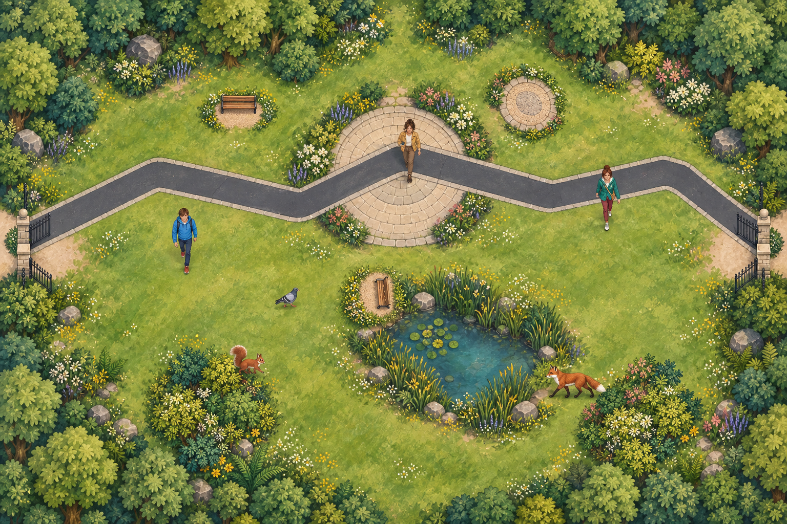
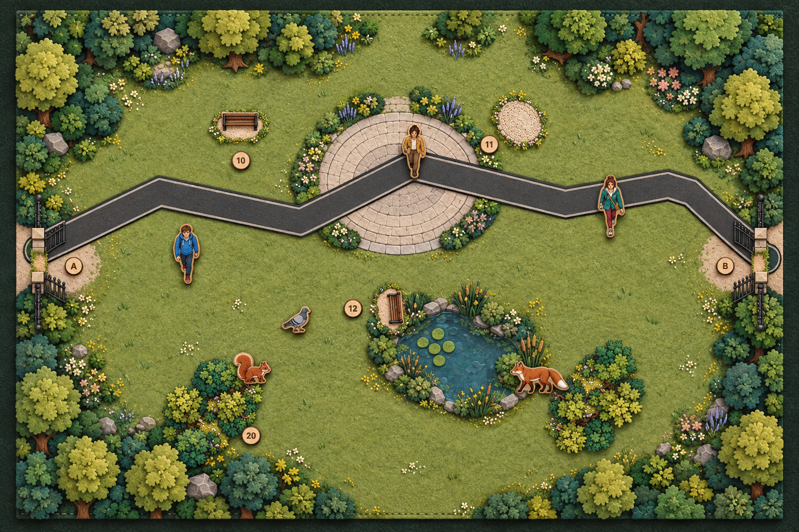
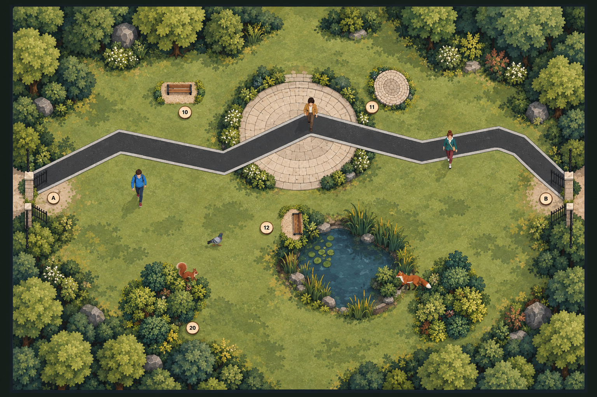
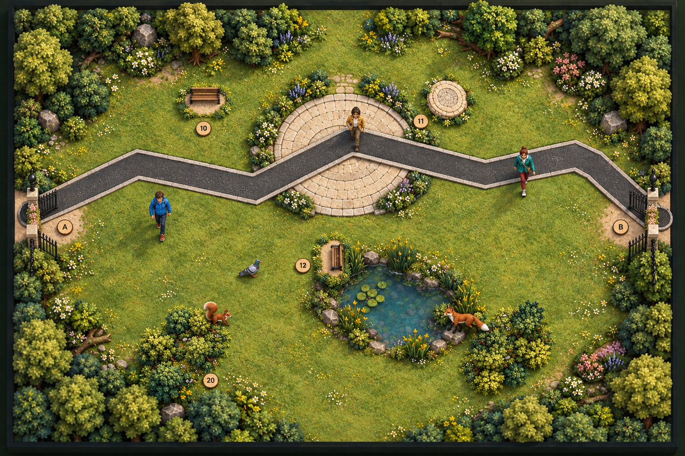

# Park art-direction drafts — 2026-09-10

These four generated concept images explore a more coherent visual language for the same P0 park layout. They are comparison drafts only; the Unity scene has not yet been changed to match one direction.

## Shared functional constraints

- Preserve the overhead 3:2 park-board composition and approximate placement of gates, asphalt route, plaza, pond, woodland, benches, people, pigeon, squirrel and fox.
- Remove the yellow plaza oval and cyan pond oval entirely.
- Show zone boundaries through paving, shoreline, planting, texture, material depth or shadow—not neon rings, halos or selection UI.
- Keep people, animals and environment within one coherent palette and rendering system.

## Options

### A — Gouache storybook

Prompt direction: gentle contemporary gouache and watercolor planning-storybook illustration; cohesive hand-painted brush texture; soft natural British park palette; plaza defined by paving and planting; pond defined by reeds, stones and damp ground.

### B — Tactile paper and felt

Prompt direction: premium tabletop prototype made from layered matte cardstock, laser-cut wood veneer and felt; restrained research-prototype aesthetic; plaza and pond boundaries expressed as physical inlays, stitching and material changes.

### C — Ecological planning map

Prompt direction: sophisticated ecological planning map and editorial strategy-game illustration; simplified shapes, subtle paper grain and limited moss/sage/stone/charcoal palette; quieter information hierarchy and less visual noise.

### D — Miniature diorama

Prompt direction: handcrafted museum-quality miniature park diorama viewed directly overhead; matte painted wood, sculpted foliage, flocked grass and restrained natural shadows; plaza inset in stone and pond recessed in translucent resin.

## Suggested decision

Option B is the strongest conceptual match for the physical magnetic-board prototype. Option C is the cleanest basis for a readable Unity MVP. A useful hybrid would use C for the digital game and borrow B's felt/wood material cues so the physical and digital layers still feel related.

Generated with the built-in image generation model using `visual-layer-v11-unified-character-palette-preview.png` as the composition reference.
